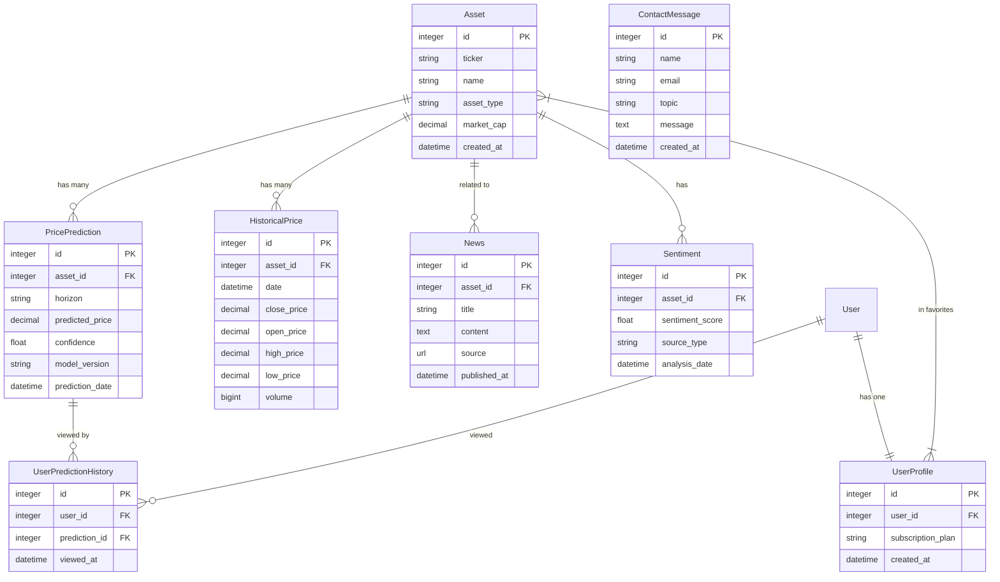
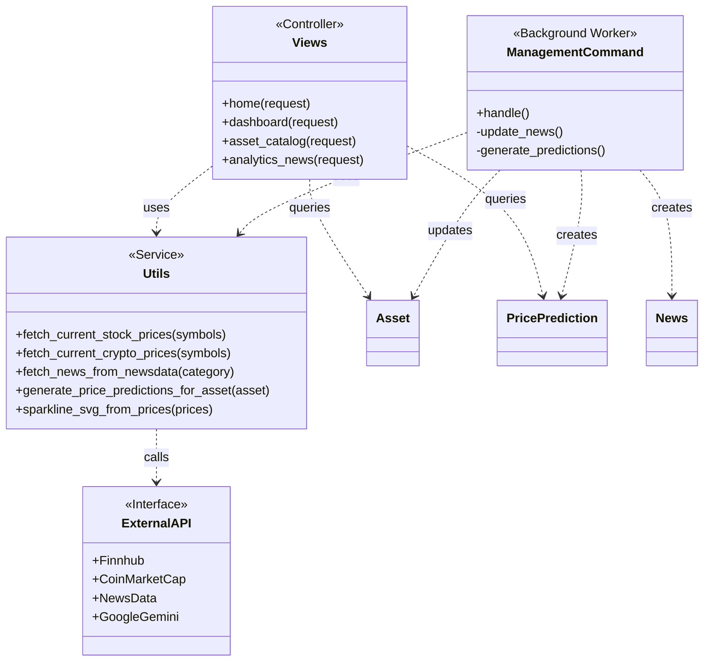
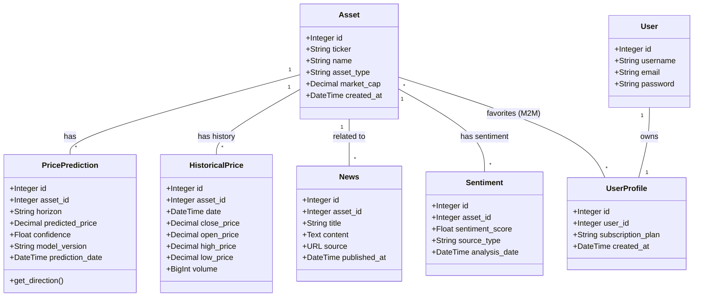

# Диаграммы проекта 80_rubley_rossii

## Для просмотра диаграм необходимо установить расширение Mermaid Preview 

## 1. ER Диаграмма (Связи сущностей)

## 2. Архитектура системы

## 3. Схема Классов БД

